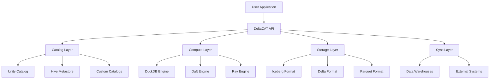

# Core Concepts

DeltaCAT is built on four fundamental components that work together to provide a complete data lakehouse solution. This overview will help you understand how these components interact and when to use each one.

## Architecture



## Component Overview

### 1. Catalog Layer

The Catalog layer provides metadata management and table discovery:

- **Namespace Management**: Organize tables into logical databases
- **Table Registry**: Track table locations, schemas, and properties
- **Schema Evolution**: Manage schema changes over time
- **Access Control**: Integrate with governance frameworks

```python
from deltacat import catalog

# Create and manage namespaces
catalog.create_namespace("production")
catalog.list_tables("production")
```

### 2. Compute Layer

The Compute layer automatically selects the optimal engine for your workload:

- **DuckDB**: In-process analytical queries (<100GB)
- **Daft**: Distributed DataFrame operations
- **Ray**: Machine learning and Python UDF execution

```python
from deltacat.compute.engine import create_engine

engine = create_engine()
result = engine.execute("SELECT * FROM table")  # Auto-selects best engine
```

### 3. Storage Layer

The Storage layer handles data persistence and format management:

- **Format Abstraction**: Unified interface across table formats
- **Compression**: Automatic data compression
- **Partitioning**: Efficient data organization
- **Statistics**: Column-level statistics for optimization

```python
from deltacat.storage.formats import UnifiedTableInterface

table = UnifiedTableInterface("s3://bucket/table")
metadata = table.get_metadata()
```

### 4. Sync Layer

The Sync layer enables data movement between systems:

- **Warehouse Sync**: Export to Snowflake, BigQuery, Redshift
- **Format Conversion**: Transform between table formats
- **Incremental Updates**: Efficient change propagation

## Data Model

### Tables

Tables in DeltaCAT are logical entities with:
- **Schema**: Column names and types
- **Location**: Physical storage path
- **Properties**: Configuration and metadata
- **Partitions**: Optional data organization

### Namespaces

Namespaces (databases) group related tables:
- Provide logical organization
- Support access control
- Enable multi-tenancy

### Transactions

DeltaCAT supports ACID transactions:
- **Atomicity**: All-or-nothing operations
- **Consistency**: Schema enforcement
- **Isolation**: Concurrent operation safety
- **Durability**: Persistent state changes

## Query Execution Flow

1. **Query Submission**: User submits SQL or DataFrame operation
2. **Query Planning**: Optimizer analyzes query complexity
3. **Engine Selection**: Choose optimal compute engine
4. **Partition Pruning**: Filter unnecessary data
5. **Execution**: Run distributed or local computation
6. **Result Collection**: Gather and return results

## Storage Formats

DeltaCAT supports multiple storage formats with different trade-offs:

| Format | Use Case | Features |
|--------|----------|----------|
| **Iceberg** | Large analytical tables | Time travel, schema evolution, hidden partitioning |
| **Delta** | Streaming + batch | ACID transactions, change data feed |
| **Parquet** | Simple columnar storage | High compression, wide compatibility |

## Best Practices

### When to Use Each Component

**Catalog**:
- Managing table metadata
- Discovering available datasets
- Enforcing governance policies

**Compute**:
- Running analytical queries
- Performing ETL operations
- Training ML models on data

**Storage**:
- Choosing table formats
- Optimizing data layout
- Managing compression

**Sync**:
- Exporting to data warehouses
- Converting between formats
- Replicating datasets

### Performance Considerations

1. **Partition Your Data**: Use partitioning for large tables
2. **Choose the Right Format**: Match format to use case
3. **Leverage Statistics**: Enable column statistics for optimization
4. **Use Appropriate Engines**: Let DeltaCAT auto-select or specify manually

## Next Steps

Dive deeper into each component:

<CardGroup cols={2}>
  <Card title="Catalog" icon="folder-tree" href="/concepts/catalog">
    Learn about metadata management
  </Card>
  <Card title="Compute" icon="microchip" href="/concepts/compute">
    Understand query execution
  </Card>
  <Card title="Storage" icon="database" href="/concepts/storage">
    Explore storage formats
  </Card>
  <Card title="Table Formats" icon="table" href="/concepts/table-formats">
    Compare format capabilities
  </Card>
</CardGroup>