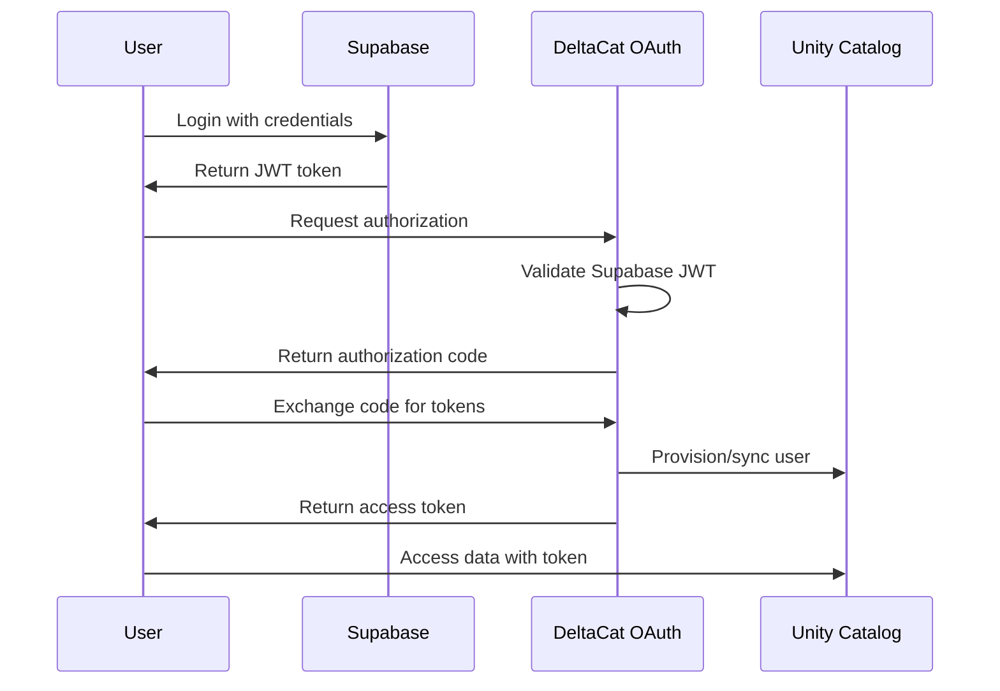

# OAuth Authentication Integration

DeltaCat 2.0 provides enterprise-grade OAuth 2.0 authentication that bridges Supabase user authentication with Unity Catalog's authorization system.

## Overview

The OAuth integration provides:
- **Standards-compliant OAuth 2.0** authorization server
- **Automatic credential rotation** for enhanced security
- **Comprehensive audit logging** of all authentication events
- **Seamless integration** between Supabase and Unity Catalog

## Architecture



## Configuration

### 1. Environment Variables

Add these to your `.env` file:

```bash
# OAuth Configuration
OAUTH_ISSUER=http://localhost:8080
OAUTH_SIGNING_ALGORITHM=RS256
OAUTH_ACCESS_TOKEN_TTL=3600
OAUTH_REFRESH_TOKEN_TTL=604800
OAUTH_AUTH_CODE_TTL=600

# Security Settings
REQUIRE_PKCE=true
REQUIRE_TLS=false  # Set to true in production
AUDIT_LOG_RETENTION_DAYS=90

# Token Rotation
TOKEN_ROTATION_ENABLED=true
TOKEN_ROTATION_INTERVAL=24h
SIGNING_KEY_ROTATION_DAYS=90

# Unity Catalog Integration
UNITY_CATALOG_URL=http://localhost:8081
UNITY_CATALOG_SERVICE_ACCOUNT=deltacat-service
```

### 2. Database Setup

Run the OAuth migration to create necessary tables:

```bash
psql -U postgres -d deltacat -f backend/migrations/002_oauth_tables.sql
```

### 3. Unity Catalog Configuration

Configure Unity Catalog to use DeltaCat's OAuth server. Edit `etc/conf/server.properties`:

```properties
# OAuth/OIDC Configuration
auth.type=OIDC
oidc.issuer=http://localhost:8080/oauth
oidc.client_id=unity-catalog-client
oidc.client_secret=${UNITY_CLIENT_SECRET}
oidc.discovery_uri=http://localhost:8080/oauth/.well-known/openid-configuration
oidc.authorization_endpoint=http://localhost:8080/oauth/authorize
oidc.token_endpoint=http://localhost:8080/oauth/token
oidc.userinfo_endpoint=http://localhost:8080/oauth/userinfo
oidc.jwks_uri=http://localhost:8080/oauth/jwks
```

## OAuth Flows

### Authorization Code Flow (with PKCE)

The primary flow for web applications:

1. **Authorization Request**
   ```http
   GET /oauth/authorize?
     response_type=code&
     client_id=YOUR_CLIENT_ID&
     redirect_uri=YOUR_REDIRECT_URI&
     scope=catalog:read catalog:write&
     state=RANDOM_STATE&
     code_challenge=CHALLENGE&
     code_challenge_method=S256
   ```

2. **Token Exchange**
   ```http
   POST /oauth/token
   Content-Type: application/x-www-form-urlencoded
   
   grant_type=authorization_code&
   code=AUTHORIZATION_CODE&
   client_id=YOUR_CLIENT_ID&
   client_secret=YOUR_SECRET&
   redirect_uri=YOUR_REDIRECT_URI&
   code_verifier=VERIFIER
   ```

3. **Token Response**
   ```json
   {
     "access_token": "eyJ...",
     "token_type": "Bearer",
     "expires_in": 3600,
     "refresh_token": "8xLO...",
     "scope": "catalog:read catalog:write"
   }
   ```

### Refresh Token Flow

Obtain new access tokens without re-authentication:

```http
POST /oauth/token
Content-Type: application/x-www-form-urlencoded

grant_type=refresh_token&
refresh_token=YOUR_REFRESH_TOKEN&
client_id=YOUR_CLIENT_ID&
client_secret=YOUR_SECRET
```

## Client Registration

Register OAuth clients programmatically or via API:

```go
// Example: Register a new OAuth client
client := models.OAuthClient{
    ClientID:     "my-app",
    ClientName:   "My Application",
    RedirectURIs: []string{"http://localhost:3000/callback"},
    GrantTypes:   []string{"authorization_code", "refresh_token"},
    Scopes:       []string{"catalog:read", "catalog:write"},
}

// ClientSecret will be hashed before storage
hashedSecret, _ := bcrypt.GenerateFromPassword([]byte("your-secret"), 10)
client.ClientSecretHash = string(hashedSecret)

db.Create(&client)
```

## Security Features

### Credential Rotation

Automatic rotation of signing keys and tokens:

- **Signing Keys**: Rotated every 90 days (configurable)
- **Access Tokens**: Short-lived (1 hour default)
- **Refresh Tokens**: Rotate on use for enhanced security

### Audit Logging

All OAuth events are logged with detailed metadata:

```sql
-- Query recent authentication failures
SELECT * FROM oauth_audit_logs 
WHERE event_type = 'AUTH_DENIED' 
  AND created_at > NOW() - INTERVAL '1 hour'
ORDER BY created_at DESC;

-- Find suspicious activity
SELECT client_id, COUNT(*) as attempts
FROM oauth_audit_logs
WHERE success = false 
  AND created_at > NOW() - INTERVAL '10 minutes'
GROUP BY client_id
HAVING COUNT(*) > 10;
```

### Encryption

- **TLS Required**: Enforce HTTPS in production
- **Token Storage**: Encrypted at rest
- **Key Management**: Support for external KMS

## API Endpoints

### OAuth Endpoints

| Endpoint | Method | Description |
|----------|--------|-------------|
| `/oauth/authorize` | GET | Authorization endpoint |
| `/oauth/token` | POST | Token endpoint |
| `/oauth/userinfo` | GET | User information (OIDC) |
| `/oauth/jwks` | GET | JSON Web Key Set |
| `/oauth/revoke` | POST | Token revocation |
| `/oauth/introspect` | POST | Token introspection |

### Management Endpoints

| Endpoint | Method | Description |
|----------|--------|-------------|
| `/api/oauth/clients` | GET | List OAuth clients |
| `/api/oauth/clients` | POST | Create new client |
| `/api/oauth/clients/:id` | PUT | Update client |
| `/api/oauth/clients/:id` | DELETE | Delete client |
| `/api/oauth/audit` | GET | Query audit logs |
| `/api/oauth/metrics` | GET | OAuth metrics |

## Monitoring

### Health Checks

Monitor OAuth server health:

```go
// Check signing key status
GET /api/health/oauth/keys

// Response
{
  "status": "healthy",
  "active_keys": 1,
  "next_rotation": "2024-03-01T00:00:00Z"
}
```

### Metrics

Track authentication metrics:

```go
GET /api/oauth/metrics

// Response
{
  "total_requests": 15234,
  "successful_auth": 14892,
  "failed_auth": 342,
  "active_sessions": 523,
  "avg_response_time_ms": 45
}
```

## Troubleshooting

### Common Issues

<Accordion>
  <AccordionItem title="Invalid redirect URI error">
    Ensure the redirect URI exactly matches one registered with the client. Check for trailing slashes and protocol (http vs https).
  </AccordionItem>
  
  <AccordionItem title="PKCE verification failed">
    Verify that:
    - The code_verifier is 43-128 characters
    - The code_challenge uses SHA256 (method=S256)
    - The verifier matches the original challenge
  </AccordionItem>
  
  <AccordionItem title="Token expired">
    Access tokens are short-lived by design. Use the refresh token to obtain new access tokens without re-authentication.
  </AccordionItem>
</Accordion>

### Debug Mode

Enable debug logging for OAuth operations:

```bash
LOG_LEVEL=debug
OAUTH_DEBUG=true
```

## Best Practices

1. **Always use PKCE** for public clients (SPAs, mobile apps)
2. **Rotate secrets regularly** - at least every 90 days
3. **Monitor audit logs** for suspicious activity
4. **Use short-lived tokens** - 1 hour or less for access tokens
5. **Implement rate limiting** on OAuth endpoints
6. **Validate redirect URIs** strictly to prevent open redirects

## Next Steps

- [Configure Unity Catalog Tables](/guides/creating-tables)
- [Set Up Data Pipelines](/guides/data-pipelines)
- [Monitor System Health](/operations/monitoring)