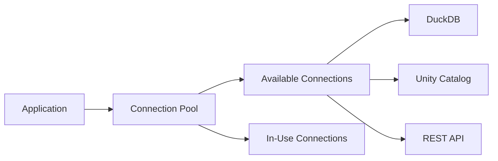

# Connection Pooling

DeltaCAT's connection pooling system manages reusable connections to eliminate the overhead of creating new connections for each operation. This is particularly beneficial for high-frequency queries and concurrent workloads.

## How It Works

The connection pool maintains a set of pre-initialized connections that are checked out when needed and returned after use:



## Configuration

### Basic Configuration

```python
from deltacat.config.performance import ConnectionPoolConfig

config = ConnectionPoolConfig(
    enabled=True,
    min_size=2,        # Minimum connections to maintain
    max_size=10,       # Maximum connections allowed
    max_idle_time=300, # Seconds before idle connection expires
    thread_safe=True   # Enable thread-safe operations
)
```

### Per-Catalog Configuration

Different catalog types can have different pool sizes:

```python
config = ConnectionPoolConfig(
    duckdb_pool_size=5,    # DuckDB connections
    unity_pool_size=10,    # Unity Catalog connections
    rest_pool_size=20      # REST API connections
)
```

### Environment Variables

```bash
# Enable/disable pooling
export DELTACAT_POOL_ENABLED=true

# Pool size configuration
export DELTACAT_POOL_MIN_SIZE=2
export DELTACAT_POOL_MAX_SIZE=10

# Connection lifecycle
export DELTACAT_POOL_IDLE_TIME=300
export DELTACAT_POOL_TIMEOUT=30
```

## Usage Examples

### Automatic Pooling with SQL Gateway

```python
from deltacat.sql.gateway import DeltaCATSQLGateway

# Connection pooling is enabled by default
gateway = DeltaCATSQLGateway(
    catalog_name="my_catalog",
    use_connection_pool=True
)

# Execute multiple queries - reuses connections
for i in range(100):
    result = gateway.sql(f"SELECT * FROM table_{i}")
```

### Manual Pool Management

```python
from deltacat.catalog.connection_pool import get_pool_manager

# Get the global pool manager
pool_manager = get_pool_manager()

# Create a custom pool
def create_custom_connection():
    return MyCustomConnection()

pool = pool_manager.get_or_create_pool(
    pool_name="custom_pool",
    create_connection=create_custom_connection,
    validate_connection=lambda conn: conn.is_valid()
)

# Use the pool
with pool.get_connection() as conn:
    # Use connection
    conn.execute_query("SELECT 1")
    # Connection automatically returned to pool
```

### DuckDB Connection Pool

```python
from deltacat.catalog.connection_pool import DuckDBConnectionPool

# Create a DuckDB-specific pool
pool = DuckDBConnectionPool(
    config=ConnectionPoolConfig(min_size=5, max_size=20)
)

# Get a connection from the pool
with pool.get_connection() as conn:
    result = conn.execute("SELECT * FROM my_table").arrow()
```

## Connection Validation

Connections are automatically validated before use and expired connections are replaced:

```python
config = ConnectionPoolConfig(
    validation_interval=60,  # Validate connections every 60 seconds
    max_idle_time=300       # Remove connections idle for 5 minutes
)

# Custom validation function
def validate_connection(conn):
    try:
        conn.execute("SELECT 1")
        return True
    except:
        return False

pool = ConnectionPool(
    name="validated_pool",
    create_connection=create_conn,
    validate_connection=validate_connection
)
```

## Monitoring

### Pool Statistics

```python
from deltacat.catalog.connection_pool import get_pool_manager

# Get pool statistics
stats = get_pool_manager().get_stats()

for pool_name, pool_stats in stats.items():
    print(f"Pool: {pool_name}")
    print(f"  Total created: {pool_stats['total_created']}")
    print(f"  Available: {pool_stats['available']}")
    print(f"  In use: {pool_stats['in_use']}")
```

### Performance Metrics

Monitor connection pool performance:

```python
# Enable performance logging
import logging
logging.getLogger("deltacat.catalog.connection_pool").setLevel(logging.INFO)

# Pool will log statistics like:
# INFO: Initialized connection pool 'DuckDB' with 2 connections
# INFO: Created new connection pool: unity_catalog
# INFO: Pool 'DuckDB' has 3 available, 2 in use
```

## Best Practices

### Pool Sizing

Choose pool sizes based on your workload:

- **Interactive queries**: `min_size=2, max_size=10`
- **Batch processing**: `min_size=5, max_size=20`
- **High concurrency**: `min_size=10, max_size=50`

### Connection Lifecycle

```python
# Configure appropriate timeouts
config = ConnectionPoolConfig(
    max_idle_time=300,      # 5 minutes for interactive
    connection_timeout=30,   # 30 second timeout
    validation_interval=60   # Validate every minute
)
```

### Thread Safety

For multi-threaded applications:

```python
config = ConnectionPoolConfig(
    thread_safe=True,  # Enable thread-safe operations
    max_size=20        # Ensure enough connections for threads
)
```

## Troubleshooting

### Connection Pool Exhaustion

If you see timeout errors:

```python
# Increase pool size
config.max_size = 50

# Or reduce connection hold time
with pool.get_connection(timeout=5) as conn:
    # Quick operation
    pass
```

### Connection Leaks

Ensure connections are properly returned:

```python
# Always use context managers
with pool.get_connection() as conn:
    # Connection automatically returned
    pass

# Or manually return
conn = pool.get_connection().__enter__()
try:
    # Use connection
    pass
finally:
    conn.__exit__(None, None, None)
```

### Disable Pooling

If you encounter issues, disable pooling:

```python
# Via configuration
gateway = DeltaCATSQLGateway(
    use_connection_pool=False
)

# Or via environment
export DELTACAT_POOL_ENABLED=false
```

## Performance Impact

Connection pooling provides significant benefits:

- **Setup Time**: 30-50% reduction in connection initialization
- **Throughput**: 2-3x improvement for short queries
- **Resource Usage**: Lower memory and CPU overhead
- **Latency**: 10-20ms reduction per query

The benefits are most pronounced for:
- High-frequency queries
- Short-running operations
- Concurrent workloads
- Remote catalog connections