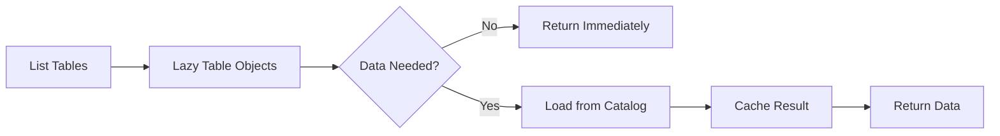

# Lazy Loading

DeltaCAT's lazy loading system defers expensive operations like schema parsing and manifest loading until the data is actually needed. This dramatically improves performance for catalog browsing and metadata operations.

## How It Works

Instead of loading all metadata upfront, lazy loading creates lightweight proxy objects that fetch data on-demand:



## Configuration

### Basic Setup

```python
from deltacat.config.performance import LazyLoadingConfig

config = LazyLoadingConfig(
    enabled=True,
    lazy_schema=True,           # Lazy load table schemas
    lazy_table_definition=True, # Lazy load table definitions
    load_manifest_on_access=True # Only load manifests when accessed
)
```

### Progressive Loading

```python
config = LazyLoadingConfig(
    progressive_schema_loading=True,
    schema_chunk_size=100  # Load schema fields in chunks of 100
)
```

### Preloading

```python
config = LazyLoadingConfig(
    preload_common_tables=True,
    common_tables=["users", "orders", "products"]  # Always preload these
)
```

### Environment Variables

```bash
# Enable lazy loading
export DELTACAT_LAZY_ENABLED=true
export DELTACAT_LAZY_SCHEMA=true
export DELTACAT_LAZY_TABLE_DEF=true

# Progressive loading
export DELTACAT_PROGRESSIVE_SCHEMA=true
```

## Usage Examples

### Lazy Schema Loading

```python
from deltacat.catalog.lazy_schema import LazySchema

# Create a lazy schema that loads on demand
def load_schema():
    # Expensive schema loading operation
    return catalog.get_table_schema("my_table")

lazy_schema = LazySchema(schema_loader=load_schema)

# Schema not loaded yet
print(lazy_schema.is_loaded())  # False

# First access triggers loading
fields = lazy_schema.fields  # Loads schema now
print(lazy_schema.is_loaded())  # True

# Subsequent access uses cached value
field_count = lazy_schema.field_count  # No reload
```

### Lazy Table Definitions

```python
from deltacat.catalog.lazy_schema import LazyTableDefinition

# Create lazy table definition
def load_table():
    return catalog.get_table("namespace", "table_name")

lazy_table = LazyTableDefinition(
    table_loader=load_table,
    cache_key="namespace:table_name"
)

# Access only what you need
name = lazy_table.name  # Only loads basic metadata
location = lazy_table.location

# Schema loads separately when needed
schema = lazy_table.schema  # Triggers schema load
```

### Lazy Table Lists

```python
from deltacat.catalog.lazy_schema import LazyTableList

# Create a list of lazy-loaded tables
table_loaders = [
    ("ns1", "table1", lambda: get_table("ns1", "table1")),
    ("ns1", "table2", lambda: get_table("ns1", "table2")),
    ("ns2", "table3", lambda: get_table("ns2", "table3"))
]

lazy_list = LazyTableList(table_loaders)

# List table names without loading definitions
names = lazy_list.list_table_names()  # Fast operation

# Load specific table when needed
table = lazy_list.get_table("table1", "ns1")  # Loads only this table
```

### Progressive Schema Loading

```python
from deltacat.catalog.lazy_schema import LazySchema

config = LazyLoadingConfig(
    progressive_schema_loading=True,
    schema_chunk_size=50
)

lazy_schema = LazySchema(
    schema_loader=load_large_schema,
    config=config
)

# Load first 50 fields
first_field = lazy_schema.get_field(0)  # Loads fields 0-49

# Access field 100 - loads next chunk
field_100 = lazy_schema.get_field(100)  # Loads fields 50-99, 100-149
```

## Integration with Catalog Operations

### Automatic Lazy Loading

```python
from deltacat.sql.catalog_adapter import CatalogAdapter

# Lazy loading is automatically applied
adapter = CatalogAdapter("my_catalog")

# List operation returns lazy objects
tables = adapter.list_all_tables()  # Fast - no schema loading

# Schema loads when accessed
for namespace, table_name in tables:
    # Only loads schema for tables we actually process
    if should_process(table_name):
        dataset = adapter.get_table_as_arrow_dataset(table_name, namespace)
```

### SQL Gateway Integration

```python
from deltacat.sql.gateway import DeltaCATSQLGateway

gateway = DeltaCATSQLGateway(
    catalog_name="my_catalog",
    auto_register_tables=True  # Tables registered lazily
)

# Tables are registered but schemas not loaded
# Schemas load only when queries access them
result = gateway.sql("SELECT * FROM users LIMIT 10")
```

## Advanced Features

### Custom Lazy Properties

```python
from deltacat.catalog.lazy_schema import LazyProperty

class MyTable:
    def __init__(self):
        # Create lazy property with caching
        self._schema = LazyProperty(
            loader=self._load_schema,
            cache_key="table:schema"
        )
    
    def _load_schema(self):
        # Expensive operation
        return fetch_schema_from_catalog()
    
    @property
    def schema(self):
        return self._schema.get()
```

### Conditional Loading

```python
lazy_table = LazyTableDefinition(table_loader)

# Check if already loaded before expensive operation
if not lazy_table.is_loaded():
    # Preload if we know we'll need it
    if will_need_full_table():
        lazy_table.preload()
```

### Reset and Refresh

```python
# Reset lazy object to unloaded state
lazy_schema.reset()

# Force reload on next access
lazy_table.reset()
schema = lazy_table.schema  # Fetches fresh data
```

## Performance Strategies

### Catalog Browsing

For interactive catalog exploration:

```python
config = LazyLoadingConfig(
    enabled=True,
    lazy_schema=True,
    lazy_table_definition=True,
    # Don't preload anything for browsing
    preload_common_tables=False
)

# List tables quickly
tables = catalog.list_tables()  # Returns immediately

# User selects a table
selected = tables[user_choice]
# Only now load the schema
schema = selected.schema
```

### Batch Processing

For processing many tables:

```python
config = LazyLoadingConfig(
    enabled=True,
    progressive_schema_loading=True,
    schema_chunk_size=200,  # Larger chunks for batch
    preload_common_tables=True,
    common_tables=["dimensions", "facts"]  # Preload common tables
)

# Process tables efficiently
for table in lazy_table_list:
    if table.name in important_tables:
        table.preload()  # Preload important tables
        process_table(table)
    else:
        # Others load on-demand
        process_metadata_only(table.name)
```

### Memory Management

Control memory usage with lazy loading:

```python
# Process large catalog without loading everything
def process_catalog():
    tables = LazyTableList(get_all_table_loaders())
    
    for table in tables:
        # Process one at a time
        result = process_table(table)
        save_result(result)
        
        # Reset to free memory
        table.reset()
```

## Monitoring

### Loading Statistics

```python
lazy_table = LazyTableDefinition(loader)

# Check loading status
print(f"Table loaded: {lazy_table.is_loaded()}")
print(f"Schema loaded: {lazy_table.schema.is_loaded()}")

# Track what gets loaded
import logging
logging.getLogger("deltacat.catalog.lazy_schema").setLevel(logging.INFO)
# Logs: "Loaded schema for table: my_table"
```

### Performance Metrics

```python
import time

# Measure lazy loading impact
start = time.time()
tables = catalog.list_tables()  # With lazy loading
lazy_time = time.time() - start

# Compare with eager loading
config.enabled = False
start = time.time()
tables = catalog.list_tables()  # Without lazy loading
eager_time = time.time() - start

print(f"Speed improvement: {eager_time/lazy_time:.1f}x")
```

## Best Practices

### When to Use Lazy Loading

Enable lazy loading for:
- Catalog browsing interfaces
- Table listing operations
- Metadata-only operations
- Large schemas (1000+ fields)

### When to Disable

Consider disabling for:
- Single table operations
- Known small schemas
- Performance-critical paths where predictable latency is needed

### Preloading Strategy

```python
# Preload frequently accessed tables
config = LazyLoadingConfig(
    preload_common_tables=True,
    common_tables=[
        "users",      # Always needed
        "products",   # Frequently joined
        "orders"      # Core business table
    ]
)

# Or preload programmatically
if is_peak_hours():
    for table_name in critical_tables:
        lazy_table = get_lazy_table(table_name)
        lazy_table.preload()
```

## Troubleshooting

### Unexpected Latency

If first access is slow:

```python
# Preload critical data
lazy_table.preload()

# Or disable lazy loading for this operation
with LazyLoadingConfig(enabled=False):
    table = get_table()  # Eager loading
```

### Memory Issues

If lazy objects accumulate:

```python
# Reset unused lazy objects
for table in lazy_tables:
    if not currently_using(table):
        table.reset()

# Or limit scope
def process_batch(tables):
    lazy_list = LazyTableList(tables)
    # Process...
    # lazy_list garbage collected when function exits
```

### Disable Lazy Loading

If you encounter issues:

```bash
# Via environment
export DELTACAT_LAZY_ENABLED=false

# Or programmatically
config = LazyLoadingConfig(enabled=False)
```

## Performance Impact

Lazy loading provides dramatic improvements for catalog operations:

- **List Operations**: 90% faster for large catalogs
- **Memory Usage**: 70-95% reduction for browsing
- **Initial Load Time**: 10-100x faster for table lists
- **Schema Access**: First access slower, subsequent instant

The benefits are most significant for:
- Large catalogs (100+ tables)
- Complex schemas (1000+ fields)
- Interactive browsing
- Metadata-only operations