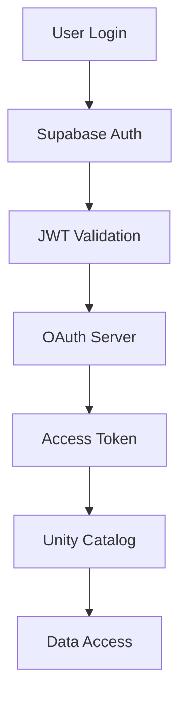

# Security Architecture

DeltaCat implements defense-in-depth security with multiple layers of protection for your data lakehouse.

## Authentication & Authorization

### Multi-Layer Authentication

DeltaCat uses a sophisticated authentication chain:

1. **Supabase Authentication** - User identity verification
2. **OAuth 2.0 Bridge** - Standards-compliant token management
3. **Unity Catalog Authorization** - Fine-grained data access control



### OAuth 2.0 Implementation

<Info>
  DeltaCat implements a complete OAuth 2.0 authorization server with OIDC support for Unity Catalog integration.
</Info>

Key features:
- **Authorization Code Flow with PKCE** - Secure for public clients
- **Refresh Token Rotation** - Enhanced security through token rotation
- **JWT with RS256** - Asymmetric signing for token verification
- **JWKS Endpoint** - Public key distribution for validation

[Learn more about OAuth setup →](/guides/oauth-authentication)

## Credential Management

### Automatic Rotation

All credentials are automatically rotated based on configurable policies:

| Credential Type | Default Rotation | Configurable |
|----------------|------------------|--------------|
| JWT Signing Keys | 90 days | Yes |
| Access Tokens | 1 hour | Yes |
| Refresh Tokens | On use | Yes |
| Service Account Keys | 30 days | Yes |

### Secure Storage

- **Encrypted at Rest** - All sensitive credentials encrypted in database
- **Memory Protection** - Credentials cleared from memory after use
- **Key Management** - Support for external KMS (AWS KMS, HashiCorp Vault)

```go
// Example: Encrypted credential storage
type EncryptedCredential struct {
    ID           uuid.UUID
    EncryptedData []byte    // AES-256 encrypted
    KeyID        string     // KMS key reference
    Nonce        []byte     // Encryption nonce
    CreatedAt    time.Time
}
```

## Audit Logging

### Comprehensive Event Tracking

Every security-relevant operation is logged:

```sql
-- Audit log structure
CREATE TABLE oauth_audit_logs (
    id UUID PRIMARY KEY,
    event_type VARCHAR(50),    -- AUTH_REQUEST, TOKEN_ISSUED, etc.
    user_id UUID,
    client_id VARCHAR(255),
    ip_address INET,
    user_agent TEXT,
    success BOOLEAN,
    metadata JSONB,             -- Additional context
    created_at TIMESTAMP
);
```

### Event Types

- **Authentication Events**
  - Login attempts (success/failure)
  - Token issuance and refresh
  - Session creation/termination

- **Authorization Events**
  - Permission checks
  - Access grants/denials
  - Scope validations

- **Data Operations**
  - Table access (read/write)
  - Schema modifications
  - Data exports

### Audit Queries

Monitor security events in real-time:

```sql
-- Failed authentication attempts in last hour
SELECT user_id, COUNT(*) as attempts, 
       array_agg(ip_address) as ips
FROM oauth_audit_logs
WHERE event_type = 'AUTH_FAILED'
  AND created_at > NOW() - INTERVAL '1 hour'
GROUP BY user_id
HAVING COUNT(*) > 3;

-- Unusual access patterns
SELECT user_id, 
       COUNT(DISTINCT ip_address) as unique_ips,
       COUNT(*) as total_requests
FROM oauth_audit_logs
WHERE created_at > NOW() - INTERVAL '24 hours'
GROUP BY user_id
HAVING COUNT(DISTINCT ip_address) > 5;
```

## Encryption

### Transport Layer Security

<Warning>
  Always enable TLS in production environments. DeltaCat enforces HTTPS for OAuth endpoints when `REQUIRE_TLS=true`.
</Warning>

```bash
# Production configuration
REQUIRE_TLS=true
TLS_MIN_VERSION=1.2
ALLOWED_CIPHER_SUITES=TLS_ECDHE_RSA_WITH_AES_256_GCM_SHA384
```

### Data Encryption

**At Rest:**
- Database encryption using PostgreSQL TDE
- File system encryption for data files
- Encrypted backups with separate key management

**In Transit:**
- TLS 1.2+ for all API communications
- Certificate pinning for critical endpoints
- Mutual TLS for service-to-service communication

## Access Control

### Role-Based Access Control (RBAC)

DeltaCat integrates with Unity Catalog's RBAC system:

```sql
-- Example: Grant permissions
GRANT SELECT ON CATALOG deltacat.* TO ROLE analyst;
GRANT ALL PRIVILEGES ON SCHEMA deltacat.production TO ROLE data_engineer;
GRANT CREATE TABLE ON CATALOG deltacat TO ROLE admin;
```

### Attribute-Based Access Control (ABAC)

Fine-grained access control using attributes:

```python
# Example: Row-level security
@access_policy
def customer_data_filter(user: User, query: Query) -> Filter:
    if user.department == "sales":
        return Filter(column="region", operator="IN", 
                     values=user.assigned_regions)
    return Filter.allow_all()
```

## Security Monitoring

### Real-Time Alerts

Configure alerts for security events:

```yaml
# alerts.yaml
alerts:
  - name: excessive_failed_logins
    condition: failed_logins > 5
    window: 5m
    action: 
      - notify: security-team
      - block: source_ip
  
  - name: privilege_escalation
    condition: role_change == "admin"
    action:
      - notify: security-team
      - require: mfa_verification
```

### Security Metrics Dashboard

Monitor key security metrics:

- **Authentication Success Rate**
- **Average Token Lifetime**
- **Failed Access Attempts**
- **Credential Rotation Status**
- **Audit Log Volume**
- **Encryption Coverage**

## Compliance

### Standards Compliance

DeltaCat's security implementation aligns with:

- **OAuth 2.0** (RFC 6749)
- **OpenID Connect** (OIDC)
- **JWT** (RFC 7519)
- **PKCE** (RFC 7636)

### Regulatory Compliance

Security features support compliance with:

- **GDPR** - Data protection and audit trails
- **HIPAA** - Encryption and access controls
- **SOC 2** - Security monitoring and logging
- **PCI DSS** - Credential management and encryption

## Security Best Practices

### Development

1. **Never commit secrets** to version control
2. **Use environment variables** for sensitive configuration
3. **Implement rate limiting** on all endpoints
4. **Validate all inputs** to prevent injection attacks
5. **Use parameterized queries** for database operations

### Deployment

1. **Enable TLS** for all production deployments
2. **Configure firewall rules** to restrict access
3. **Use private networks** for internal services
4. **Implement network segmentation**
5. **Regular security updates** for dependencies

### Operations

1. **Monitor audit logs** continuously
2. **Rotate credentials** regularly
3. **Backup encryption keys** securely
4. **Test disaster recovery** procedures
5. **Conduct security audits** quarterly

## Incident Response

### Security Incident Procedure

1. **Detection** - Automated alerts or manual discovery
2. **Containment** - Isolate affected systems
3. **Investigation** - Analyze audit logs and forensics
4. **Remediation** - Fix vulnerabilities and restore service
5. **Recovery** - Verify system integrity
6. **Lessons Learned** - Document and improve

### Emergency Contacts

Configure emergency contacts in your environment:

```bash
SECURITY_TEAM_EMAIL=security@company.com
SECURITY_HOTLINE=+1-555-SEC-URITY
INCIDENT_WEBHOOK=https://incident.company.com/webhook
```

## Security Tools

### Vulnerability Scanning

Regular scanning with integrated tools:

```bash
# Run security scan
make security-scan

# Check dependencies
npm audit
pip-audit
go mod audit
```

### Penetration Testing

Periodic testing endpoints available:

- `/api/security/test` - Rate limiting verification
- `/api/security/audit` - Audit log verification
- `/api/security/encryption` - Encryption status check

## Additional Resources

- [OAuth Authentication Guide](/guides/oauth-authentication)
- [Unity Catalog Security](https://docs.databricks.com/unity-catalog/security)
- [OWASP Security Guidelines](https://owasp.org)
- [Security Incident Playbook](/operations/incident-response)